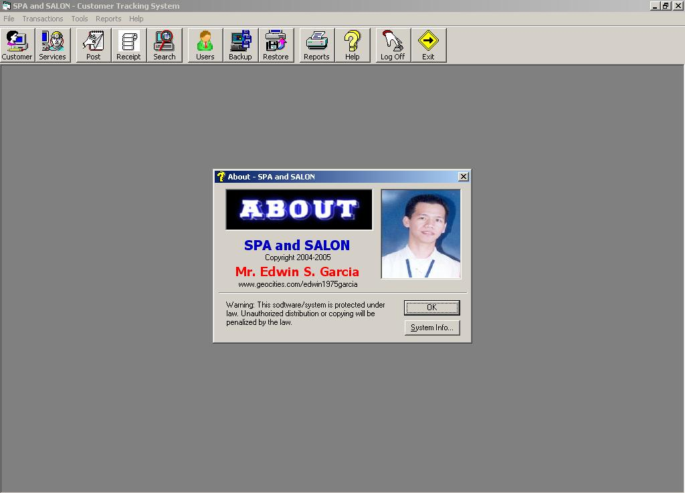



## ADO Programming Basic \(Bound\)

### Description

This is a sample Thesis I designed from one of the student in Centro Escolar University. The system will allow the user to Login with the Username and Password ("Admin" -&gt; default password), the system consist of file maintenance for Customers, Employee and Services, Transaction Processing of Services and Generation of Reports. It also includes Utilities such as backup and restore. For more information you can Email me at esg_stimalolos@yahoo.com or call/text me at +639276719302

Please VOTE for me... Thanks! Happy Programming!
 
### More Info
 
Username: Admin

Password: Admin

Customer, Employee and Services Informations

This will a great reference for those students who would like to learn the basic of ADO and other Visual Basic Components

             |
---                |---
**Submitted On**   |2006-01-30 09:03:04
**By**             |[Edwin Santos Garcia](https://github.com/Planet-Source-Code/PSCIndex/blob/master/ByAuthor/edwin-santos-garcia.md)
**Level**          |Advanced
**User Rating**    |3.8 (19 globes from 5 users)
**Compatibility**  |VB 6\.0
**Category**       |[Complete Applications](https://github.com/Planet-Source-Code/PSCIndex/blob/master/ByCategory/complete-applications__1-27.md)
**World**          |[Visual Basic](https://github.com/Planet-Source-Code/PSCIndex/blob/master/ByWorld/visual-basic.md)
**Archive File**   |[Visual\_Bas1968751292006\.zip](https://github.com/Planet-Source-Code/edwin-santos-garcia-ado-programming-basic-bound__1-64176/archive/master.zip)

